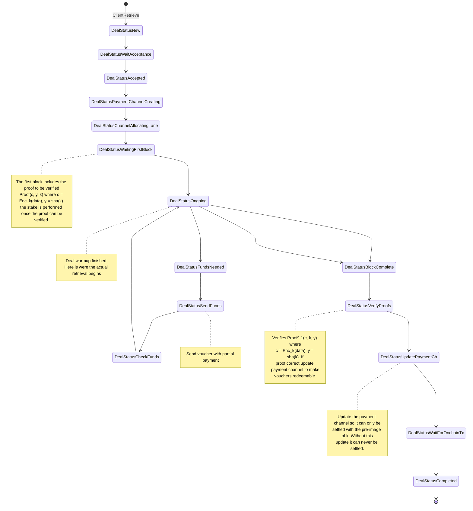

**[!!] This will be removed soon. Keeping it here for completion for now.**

# ~~Continous ZKCP~~ !! This is essentially zkcp-per-chunk
This is fundamentally wrong. Hash-lock transactions are always done in Filecoin through a payment
channel, so this is essentially the ZKCP-per-chunk.
~~Is the traditional ZKCP proposal for chunks leveraging payment channels and partial payments.
There is a voucher exchange with intermediate payments for each encryped chunk.
The provider needs to release the key to redeem the vouchers and settle
the payment channel. The client can't escape with the data sent (it is
encrypted).~~

~~**Implementation requirements:**~~

* Building the right proofs for the data to send them through data channel.
    - Proof for the whole data.
* Hash-lock transactions in Filecoin
* Upgradable payment channels to include verification through hash-lock.

**Cons**
This schemes opens the door to a lot of useless work if one of the parties aborts.
It can be secure but wasteful.
I don't think it offers any improvement to the traditional ZKCP. This merged
with the 1-bit ZKCP could make sense.~~

### Client
* To settle the payment channel, the provider needs to send k for redemption. 
Vouchers are hash-locked.

### Provider
