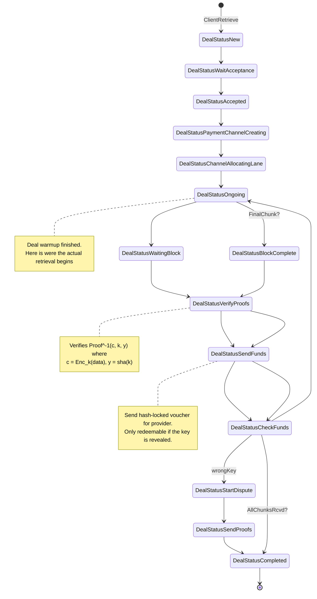
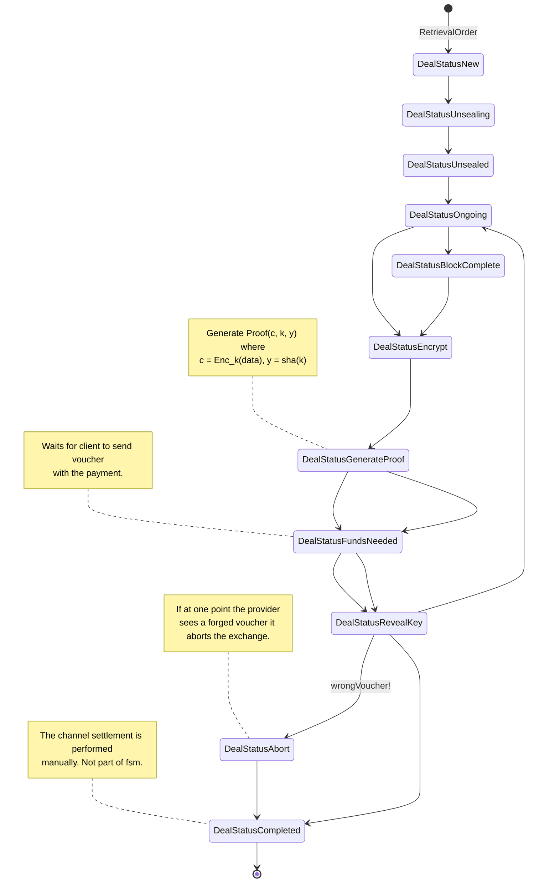

# State machine designs

## Optimistic ZKCP
It can be seen like an "optimistic" zkcp-per-chunk with a judge to solve disputes. 
There is no need to pause the exchange between chunk and voucher exchanges.
* A payment channel to cover the retrieval costs is set up client and provider.
* The client encrypts the chunks of data with a different key, and generates a proof
of integrity and a proof of computation for each chunk.
* In exchange for each chunk, the client sends a hash-locked voucher. The provider then reveals the key for that chunk.There is no need for intermediate redemtpion of vouchers
or any on-chain messages.
* When the exchange finishes, the provider can redeeem the vouchers on-chain to access the payment.
* There is a way to recover funds in a fair way if there is a misbehavior by any of the parties
    * If provider sends wrong key or wrong proof, the client can go to the judge to make a dispute and request a slash (and recover the funds).
    * The only weak point is if the client sends the wrong voucher and runs with the data, there is no easy way to fix this except by using some kind of reputations systems.

**Implementation requirements:**
* Building the right proofs for the data to send them through data channel.
    - Proof for the whole data or data chunks.
* Retrieval actor to manage optimistic ZKCP stages

**Pros**
* Partial payments are possible, something that was hard to achieve in ZKCP without releasing
the key. Requires the generation of more proofs.

**Improvement proposals**
* Instead of having to set up a payment channel with every miner there could be a per-wallet
general-purpose deposit for fast retrievals (we would need to evaluate the risks of double-spending).

### Client

### Provider

