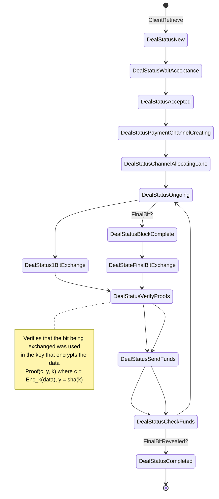
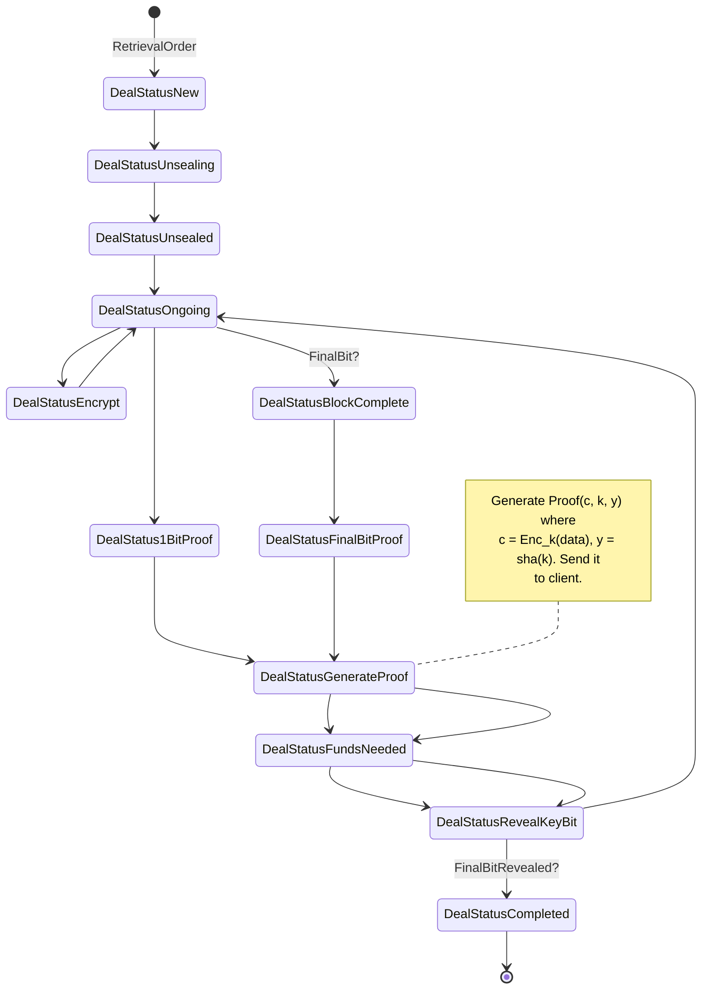

# ZKCP-1bit
Instead of having to use a different key for each chunk like in
a traditional chunk-based ZKCP, all the data is encrypted with the same `k` of
`n bits`. There is a payment and a fair-exchange for 1 bit of the key every `m/n`.
It is an adaptation of the traditional ZKCP-per-chunk and continous-ZKCP.
To prevent attacks from both parties, the provider needs to redeem the previous voucher
the moment it reveals the key-bit, and
before sending the next batch of chunks. The provider may choose to follow an optimistic
approach and trust the client all the way. In this case, it sends the key to the client
and defers the redemption of the vouchers to the end of the exchange (without a judge actor like
in optimistic-zkcp this may mean that the client runs with the data without paying).

**Implementation requirements:**
* Building the right proofs for the data to send them through data channel.
    - Proof for the whole data.
    - Proof that the bit for the data belongs to the key
* Hash-lock transactions in Filecoin

**Pros**
Partial payments are possible, something that was hard to achieve in ZKCP without releasing
the key. Requires the generation of more proofs.

### Client

### Provider
