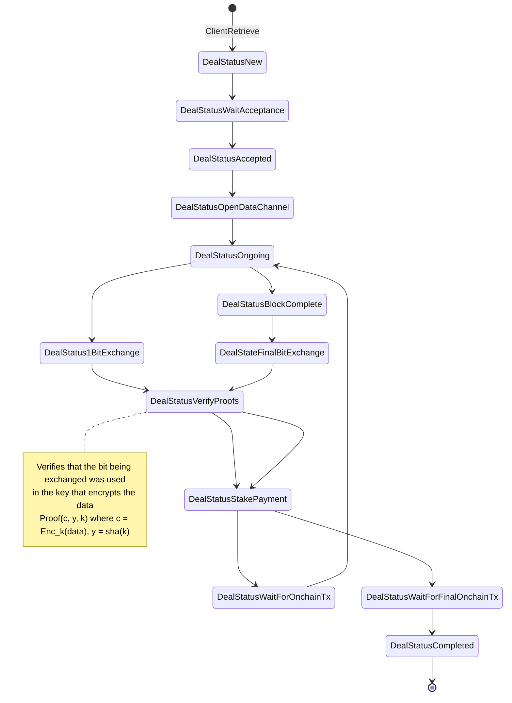
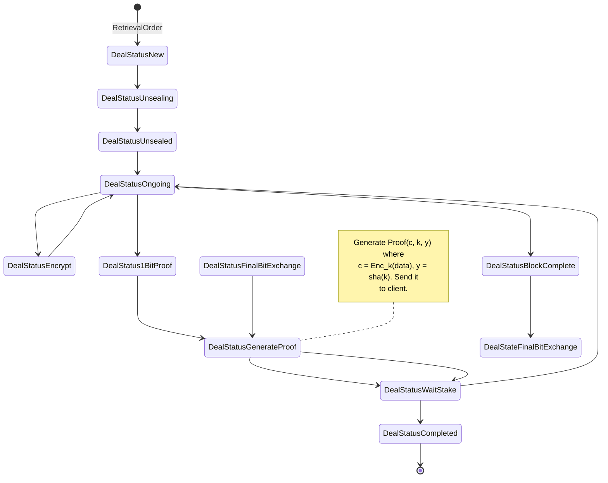

# State machine designs

## ZKCP-1bit
Instead of having to use a different key for each chunk like in
a traditional chunk-based ZKCP, all the data is encrypted with the same `k` of
`n bits`. There is a payment and a fair-exchange for 1 bit of the key every `m/n`.
It is a mix between traditional ZKCP-per-chunk and continous-ZKCP.

There is no need for a payment channel.

**Implementation requirements:**
* Building the right proofs for the data to send them through data channel.
    - Proof for the whole data.
    - Proof that the bit for the data belongs to the key
* Hash-lock transactions in Filecoin

**Pros**
Partial payments are possible, something that was hard to achieve in ZKCP without releasing
the key. Requires the generation of more proofs.

### Client

### Provider
