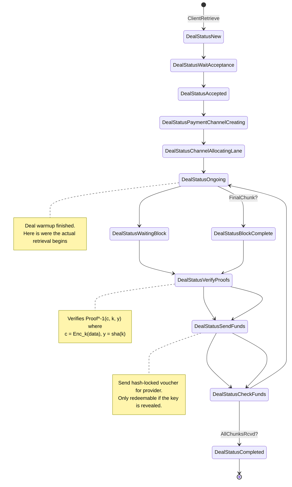
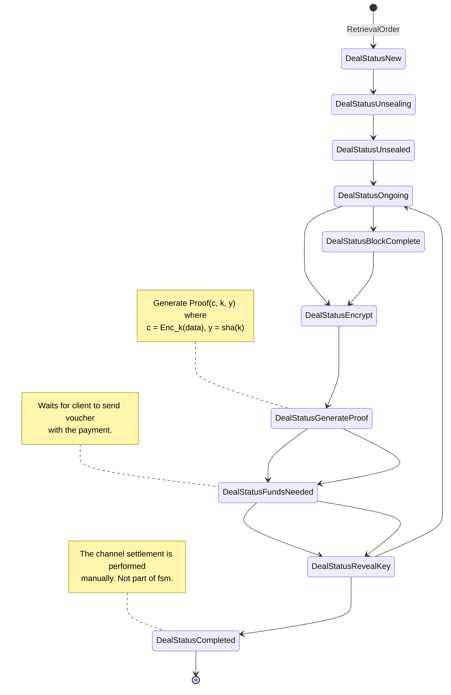

# ZKCP-per-chunk
This assumes a ZKCP protocol with a proof-of-retrievability per chunk.
Is the traditional ZKCP proposal but running a fair-exchange for
each chunk instead of doing it for the whole file.
* This would allow the use of fixed-size chunks.

**Implementation requirements:**
* Building the right proofs for the data to send them through data channel.
    - Proof of chunks of data (potentially different sizes, or pre-agreed sizes).
* Hash-lock transactions in Filecoin

### Client

### Provider

