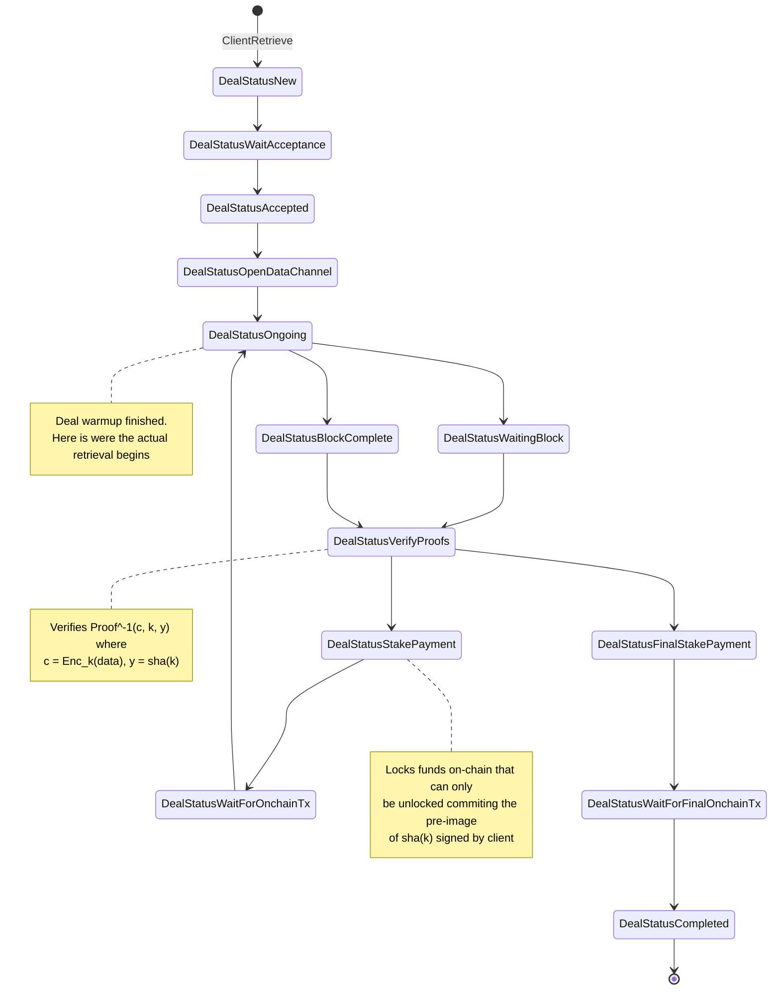
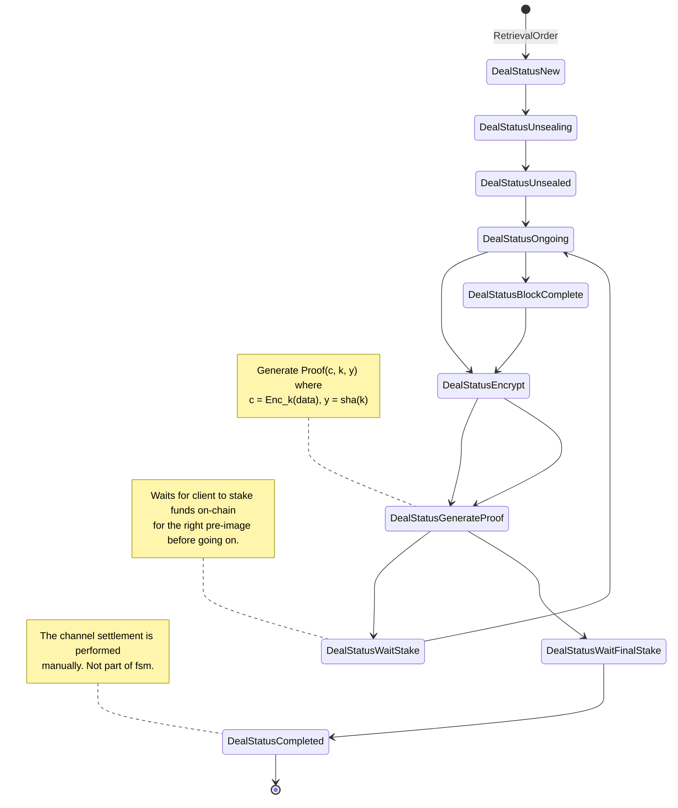

# State machine designs

## ZKCP-per-chunk
This assumes a ZKCP protocol with a proof-of-retrievability per chunk.
Is the traditional ZKCP proposal for chunks without the use of payment channels.

**Implementation requirements:**
* Building the right proofs for the data to send them through data channel.
    - Proof of chunks of data (potentially different sizes, or pre-agreed sizes).
* Hash-lock transactions in Filecoin

### Client
* To unlock the deposit, the provider sends `k` in the transaction
to validate the pre-image, and the client can get knowledge of the key
used to encrypt the data.

### Provider

