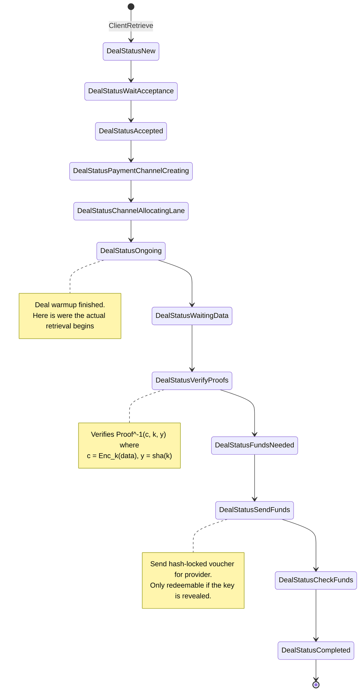
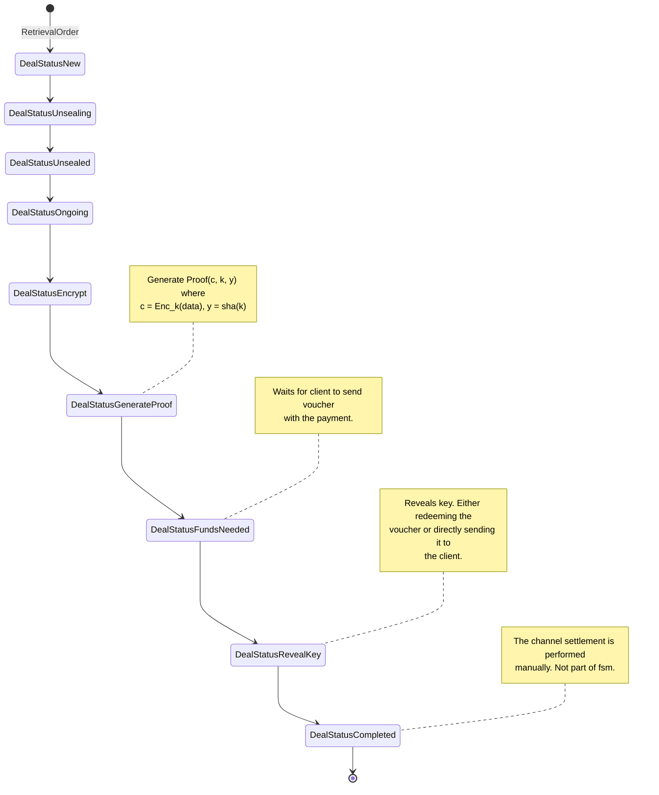

# Baseline ZKCP
ZKCP for the full data. The payment channel is required to
perform the hash-lock transaction in Filecoin.
* Client creates payment channel with enough funds for the payment.
* Opens pull-data channel with the provider storing the content.
* The provider sends the data and the proofs.
* Client sends a hash-locked voucher with the funds for the payment.
* To redeem the voucher the provider needs to expose the key.

**Implementation requirements:**
* Building the right proofs for the data to send them through data channel.
    - Proof of the whole data (or chunks of data).
    - Proof of an encryption key.
* Hash-lock transactions in Filecoin

**Potential Optimizations:**
- Single proof-of-retreivability for the whole data (all data in a single chunk).
- Proofs for some of the chunks.
- Pre-computed encryptions and proofs.
    - There are pre-computed encryptions for the data with different keys.
    - The fair exchange is performed for the key that encrypted the encryption key and not the encryption key itself.
- Use payment channel to perform incremental payments which are settled by a fair exchange.

### Client

### Provider

