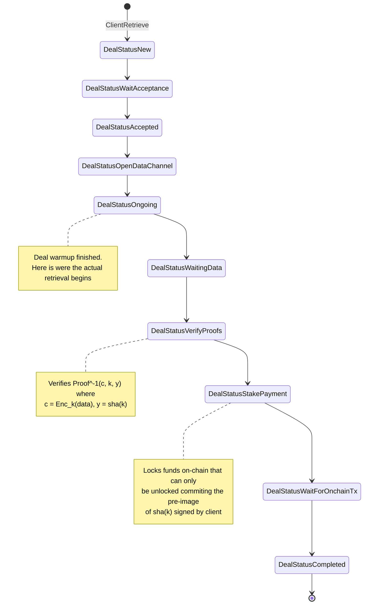
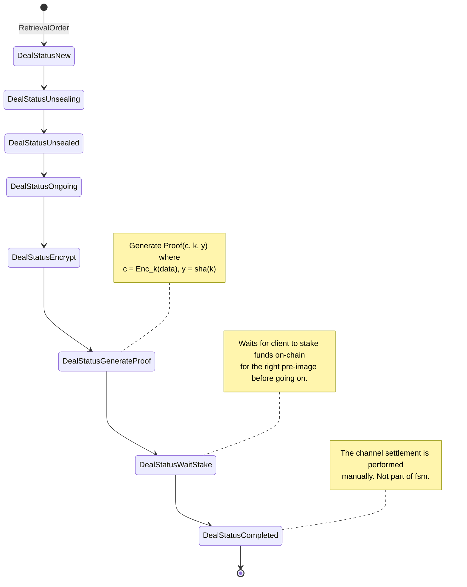
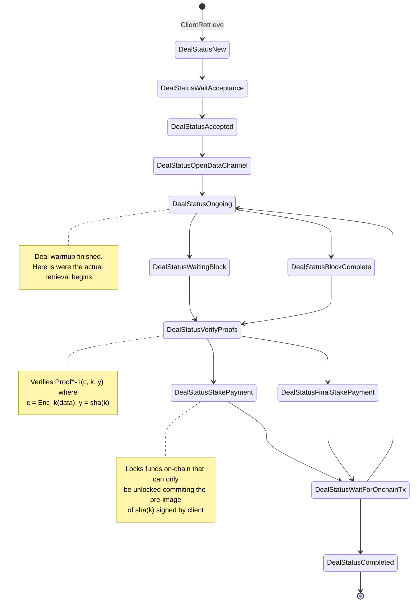
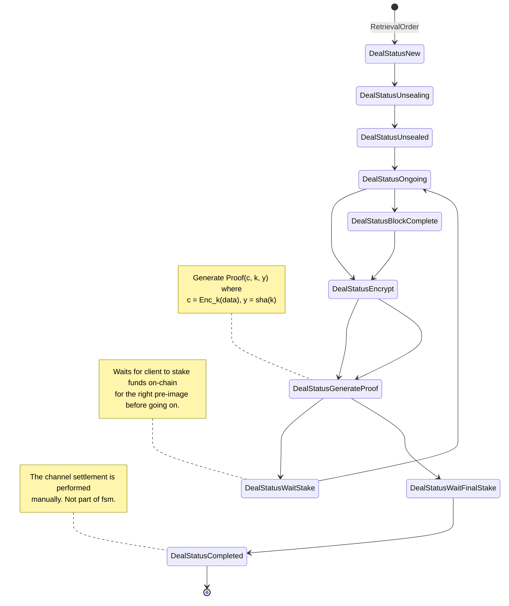

# State machine designs

## Baseline ZKCP
ZKCP for the full data without payment channels.

**Implementation requirements:**
* Building the right proofs for the data to send them through data channel.
    - Proof of the whole data (or chunks of data).
    - Proof of an encryption key.
* Hash-lock transactions in Filecoin

**Potential Optimizations:**
- Single proof-of-retreivability for the whole data (all data in a single chunk).
- Proofs for some of the chunks.
- Pre-computed encryptions and proofs.
    - There are pre-computed encryptions for the data with different keys.
    - The fair exchange is performed for the key that encrypted the encryption key and not the encryption key itself.
- Use payment channel to perform incremental payments which are settled by a fair exchange.

### Client
* To unlock the deposit, the provider sends `k` in the transaction
to validate the pre-image, and the client can get knowledge of the key
used to encrypt the data.



### Provider


## ZKCP-per-chunk
This assumes a ZKCP protocol with a proof-of-retrievability per chunk.
Is the traditional ZKCP proposal for chunks without the use of payment channels.

**Implementation requirements:**
* Building the right proofs for the data to send them through data channel.
    - 
* Hash-lock transactions in Filecoin


### Client
* To unlock the deposit, the provider sends `k` in the transaction
to validate the pre-image, and the client can get knowledge of the key
used to encrypt the data.



### Provider



## ZKCP-per-chunk with payment channels
This assumes a ZKCP protocol with a proof-of-retrievability per chunk.
Is the traditional ZKCP proposal for chunks with payment channels.
There is a voucher exchange with intermediate payments for each chunk.
The provider needs to release the key to redeem the vouchers and settle
the payment channel. The client can't escape with the data sent (it is
encrypted).

**Implementation requirements:**
* Building the right proofs for the data to send them through data channel.
* Hash-lock transactions in Filecoin


### Client
* To settle the payment channel, the provider needs to send k for redemption. 

```mermaid
stateDiagram-v2
[*] --> DealStatusNew: ClientRetrieve
DealStatusNew --> DealStatusWaitAcceptance
DealStatusWaitAcceptance --> DealStatusAccepted
DealStatusAccepted --> DealStatusOpenDataChannel
DealStatusAccepted --> DealStatusPaymentChannelCreating
DealStatusPaymentChannelCreating --> DealStatusChannelAllocatingLane
DealStatusChannelAllocatingLane --> DealStatusOngoing

DealStatusOngoing --> DealStatusWaitingFirstBlock
DealStatusWaitingBlock --> DealStatusVerifyProofs
DealStatusVerifyProofs --> DealStatusStakePayment
DealStatusStakePayment --> DealStatusWaitForOnchainTx
DealStatusWaitForOnchainTx --> DealStatusOngoing

note right of DealStatusOngoing
Deal warmup finished.
Here is were the actual retrieval begins
end note

note right of DealStatusFirstBlock
Deal warmup finished.
Here is were the actual retrieval begins
end note

DealStatusOngoing --> DealStatusWaitingBlock
DealStatusWaitingBlock --> DealStatusVerifyProofs
DealStatusVerifyProofs --> DealStatusStakePayment
DealStatusStakePayment --> DealStatusWaitForOnchainTx
DealStatusWaitForOnchainTx --> DealStatusOngoing

note right of DealStatusVerifyProofs
Verifies Proof^-1(c, k, y) where
c = Enc_k(data), y = sha(k)
end note
DealStatusOngoing --> DealStatusBlockComplete
DealStatusBlockComplete --> DealStatusVerifyProofs
DealStatusVerifyProofs --> DealStatusFinalStakePayment
DealStatusFinalStakePayment --> DealStatusWaitForOnchainTx
DealStatusWaitForOnchainTx --> DealStatusCompleted
DealStatusCompleted --> [*]

note right of DealStatusStakePayment
Locks funds on-chain that can only
be unlocked commiting the pre-image
of sha(k) signed by client
end note
```

### Provider
